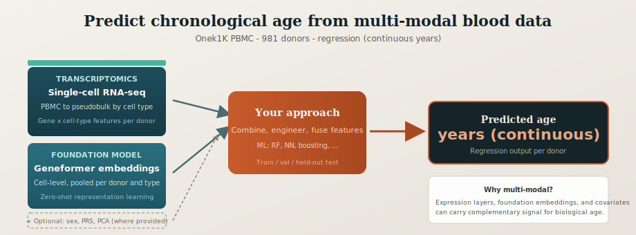

# AI for Life Sciences Hackathon 2026 — Age Prediction Challenge

**13 April & 12 May 2026 · Avenue Campus, University of Southampton**

> Predict donor chronological age from single-cell RNA-seq data.  
> Contact: [IfLSAdmin@soton.ac.uk](mailto:IfLSAdmin@soton.ac.uk)

## Introduction

Ageing impacts our immune systems, increasing the susceptibility to inflammation-driven disorders, including non-malignant diseases such as atherosclerotic cardiovascular diseases, and malignant diseases such as blood cancers. "Aging clock" is the using of machine-learning methods to capture the dynamics of aging through the integration of aging-related markers at the molecular level. Single-cell RNA-sequencing (scRNA-seq) provide the potential to develop cell-type-specific aging models.

---

## The Challenge

You are given **peripheral blood mononuclear cell (PBMC) single-cell RNA-seq** data from the
[Onek1K cohort](https://www.science.org/doi/10.1126/science.abf3041) (981 donors, ages 19–79).
Your goal is to predict each donor's **chronological age** as accurately as possible using any
method you choose.




*You may combine transcriptomic features, pre-trained single-cell embeddings, and optional covariates (where provided) to estimate chronological age — the baseline uses pseudobulk + Random Forest; other fusion strategies are encouraged.*

---

## Timeline

| Date | Milestone |
|------|-----------|
| 9 April 2026 | Data released, competition opens |
| 13 April 2026 | Hackathon day, and test data released (ages hidden) |
| 4 May 2026 | Final results submission deadline |
| 12 May 2026 | Final event; presentations and prizes |

## Competition data

The **train**, **validation**, and **test** splits **partition 981 donors** in total. **Age** is given to competitors only where noted in the table below.

| Data split | Number of individuals | Age (available or hidden) | Date of release |
|------------|----------------------:|---------------------------|-------------------|
| Training data | 781 | Available | 9 April 2026 |
| Validation data | 95 | Available | 9 April 2026 |
| Test data | 105 | Hidden | 13 April 2026 |

File paths and column-level specs: [data/README.md](data/README.md).

### Raw data

- **Single-cell RNA-seq** — Cell-level gene expression as a sparse **cells × genes** count matrix in AnnData (`.h5ad`), with per-cell metadata (`donor_id`, `celltype`, QC fields, etc.), released **per split** (`train` / `val` / `test`).
- **Genotyping (VCF)** — Variant call format with one column per competition `donor_id`, containing reference/alternate alleles and per-sample genotype fields (the primary **raw** genetic readout for the challenge).

### Pre-processed data (to facilitate the competition)

- **Pseudobulk scRNA-seq** — Counts aggregated per donor within **five major immune cell types** (CD4 T, CD8 T, NK, B cells, monocytes), as pseudobulk `.h5ad` objects (see tutorials).
- **Geneformer cell-level embeddings** — For each cell, a **1,152-dimensional** vector from the **Geneformer** foundation model, distributed as split-wise parquet files (optional download due to size).
- **Geneformer pseudobulk features** — Embeddings **aggregated per donor and cell type**; flattened across the five types this yields **5,760** numeric features per donor (`geneformer_pseudobulk_{train,val,test}.tsv.gz`).
- **Genotype table (TSV)** — A compact **donors × SNPs** matrix (genotype calls or dosages) aligned to the same anonymised `donor_id` as the transcriptomic data, derived from the VCF for easier modelling.
- **Genotype principal components** — **PCs** computed from the genotype matrix for each donor, supplied as a low-dimensional genetic background covariate set.

---

## Getting Started on Iridis X (University of Southampton HPC)

### Step 1 — Get the repository and container

The competition repo and the Bionemo container are pre-staged on the shared scratch space.
Copy them to your home directory:

```bash
cp -r /scratch/aazd1f17/shared_space/aging-challenge-2026 ~/aging-challenge-2026
```

This gives you:
```
~/aging-challenge-2026/
├── container/
│   └── bionemo-framework_nightly.sif   ← Apptainer container (all dependencies included)
├── notebooks/                           ← teaching notebooks
├── models/                              ← baseline scripts
├── data_prep/
└── ...
```

Alternatively, clone from GitHub and download the container separately:
```bash
git clone https://github.com/ad2n15/aging-challenge-2026.git ~/aging-challenge-2026
# Container is too large for git — copy it from shared space:
cp /scratch/aazd1f17/shared_space/aging-challenge-2026/container/bionemo-framework_nightly.sif \
   ~/aging-challenge-2026/container/
```

---

### Step 2 — Launch Jupyter via Open OnDemand

Open OnDemand lets you run Jupyter notebooks interactively in the Bionemo container
**without writing any SLURM scripts**.

1. Go to **[https://iridisondemand.soton.ac.uk/pun/sys/dashboard](https://iridisondemand.soton.ac.uk/pun/sys/dashboard)**
   and log in with your Iridis credentials.

2. Click the **"Jupyter with Apptainer Test"** icon.

3. Fill in the form:

   | Field | Value |
   |-------|-------|
   | **Working Directory** | `~/aging-challenge-2026` (or leave as `$HOME`) |
   | **User Interface** | `Jupyter Lab` |
   | **Submission Environment** | `container (advanced)` |
   | **Container File** | `/scratch/aazd1f17/shared_space/aging-challenge-2026/container/bionemo-framework_nightly.sif` — or, if you copied it locally: `~/aging-challenge-2026/container/bionemo-framework_nightly.sif` |
   | **Apptainer flags** | `--nv --bind $PWD:$PWD --pwd $PWD` |

4. Click **Launch** and wait for the session to start (~1–2 min).

5. In the Jupyter file browser, open notebooks under `notebooks/`. New to molecular biology? Start with **`00_biology_genome_and_ngs_primer.ipynb`**, then **`01_anndata_and_pseudobulk.ipynb`**.

#### Use shared data without copying (optional)

Notebooks expect competition files under **`data/`** at the repo root (see `data/README.md`). They do **not** read from `/scratch/...` unless you bind or symlink that path into `data/`.

Binding scratch to itself (`--bind /scratch/.../data:/scratch/.../data`) often **fails** because:

- That path may not exist on the **compute node** where Jupyter runs (scratch layout can differ from the login node).
- Even when it works, nothing points your code at that path — you would still need symlinks or code changes.

**Working pattern:** mount the shared folder **on top of** `data/` in your clone (second bind overlays that directory only):

```text
--nv \
--bind $HOME/aging-challenge-2026:$HOME/aging-challenge-2026 \
--bind /scratch/aazd1f17/shared_space/aging-challenge-2026/data:$HOME/aging-challenge-2026/data \
--pwd $HOME/aging-challenge-2026
```

Replace `$HOME/aging-challenge-2026` if your repo lives elsewhere. **Do not use `-H $PWD`** here unless you know your home is writable inside the container; the two `--bind` lines above are enough.

**Check access from a compute node** (login node is not enough):

```bash
srun --partition=amd --nodes=1 --time=2:00 ls /scratch/aazd1f17/shared_space/aging-challenge-2026/data
```

If that fails, ask the cluster admins whether `/scratch/aazd1f17` is visible on batch nodes, or keep using **local copies** of the data (see `data/README.md`).

---

### Step 3 — Run scripts from the terminal (batch jobs)

For longer runs (training, pseudobulk generation), submit via SLURM:

```bash
cd ~/aging-challenge-2026

# Train baseline model
sbatch run_binemo_AMD.sh models/train_age_model.py \
    --input PATH/TO/pseudobulk/combined_pseudobulk_donor_aggregated.h5ad

# Monitor job
tail -f slurm-JOBID.out
```

---

## Data

### Access

Download the competition data package from the link provided in the registration email.
**Iridis users:** data is already available — see Step 1 above.

```
aging_challenge_data/
├── onek1k/
│   ├── train.h5ad                               # 781 donors — age included
│   ├── val.h5ad                                 #  95 donors — age included
│   ├── test.h5ad                                # 105 donors — age EXCLUDED
│   ├── pseudobulk/
│   │   └── combined_pseudobulk_donor_aggregated.h5ad   # 981 donors × 141,390 features
│   └── donor_metadata.csv                       # donor_id, split, sex
└── README_data.md                               # data dictionary
```

### What is in the h5ad files

Each h5ad file contains:
- **`X`** — raw count matrix (cells × 35,477 genes, sparse)
- **`obs`** — cell-level metadata: `donor_id`, `celltype`, `age` *(train/val only)*, `_split`, QC columns

### Donor metadata

`donor_metadata.csv` contains: `donor_id`, `split`, `sex`, `sex_binary` (0=female, 1=male).
**Age is NOT included for test donors.**

### Gene names

Genes are stored as Ensembl IDs (e.g. `ENSG00000120163`).

---

## Baseline Approach

We provide a **Random Forest baseline** that:
1. Aggregates cell-level counts to **pseudobulk** (sum per donor × cell type)
2. Selects top-variance genes as features
3. Trains a Random Forest regressor

**Baseline validation performance (Onek1K):**

| MAE | RMSE | R² | Pearson | Spearman |
|-----|------|-----|---------|---------|
| ~9.2 years | ~12.1 | ~0.47 | ~0.69 | ~0.60 |

You are encouraged to improve on this using any technique.

---

## Repository Structure

```
aging_challenge_2026_public/
├── README.md                          ← you are here
├── data/
│   └── README.md                      ← data download instructions
├── data_prep/
│   └── h5ad_to_pseudobulk.py          ← aggregate cells → pseudobulk
├── models/
│   ├── train_age_model.py             ← baseline Random Forest (train + val eval)
│   ├── evaluate_val.py                ← evaluate your val predictions
│   └── README.md
├── notebooks/
│   ├── 00_biology_genome_and_ngs_primer.ipynb  ← genome → RNA-seq → h5ad (no biology background needed to start here)
│   ├── 01_anndata_and_pseudobulk.ipynb     ← understand the data format
│   ├── 02_baseline_model.ipynb             ← run and understand the baseline
│   ├── 03_evaluation_metrics.ipynb         ← understand MAE, R², Pearson, Spearman
│   └── 04_geneformer_embeddings.ipynb      ← advanced: foundation model features
└── submission/
    └── submission_template.csv            ← format your submission here
```

---

## Pseudobulk Pipeline (recommended starting point)

```bash
# Step 1 — build pseudobulk from the combined h5ad
python data_prep/h5ad_to_pseudobulk.py \
    path/to/combined.h5ad \
    -o path/to/pseudobulk_output/

# Step 2 — train the baseline model
python models/train_age_model.py \
    --input path/to/pseudobulk_output/combined_pseudobulk_donor_aggregated.h5ad

# Step 3 — evaluate on validation set
python models/evaluate_val.py \
    --predictions models/output/TIMESTAMP/val_predictions.csv
```

On the Iridis HPC cluster, prepend `sbatch run_binemo_AMD.sh` to each command.

---

## Submission Format

Submit a **CSV file** with exactly two columns:

```csv
sample_id,predicted_age
1,42.3
2,67.1
3,28.9
...
```

- `sample_id` = the anonymised integer `donor_id` from `test.h5ad`
- `predicted_age` = your predicted age (float, years)
- Must include **all 105 test donors** — missing donors score as MAE = 40

See `submission/submission_template.csv` for the list of test donor IDs.

Submit via email to [IfLSAdmin@soton.ac.uk](mailto:IfLSAdmin@soton.ac.uk) with subject:
`[AGE CHALLENGE SUBMISSION] Team Name`

Submissions are due before the hackathon event on **13 April 2026**.

---

## Evaluation Metrics

Submissions are ranked by **MAE (Mean Absolute Error)** — lower is better.

We also report RMSE, R², Pearson r, and Spearman ρ for reference.

See `notebooks/03_evaluation_metrics.ipynb` for a full explanation with examples.

---

## Ideas for Improvement

| Idea | Difficulty | Expected impact |
|------|-----------|-----------------|
| Tune RF hyperparameters (`--n-estimators`, `--max-depth`) | Low | Low–medium |
| Use more genes (`--n-genes 5000`) | Low | Low |
| Add sex as a feature (`--sex`) | Low | Low |
| Use all features (`--all-features`) | Low | Medium |
| Try gradient boosting (XGBoost / LightGBM) | Medium | Medium–high |
| Use Geneformer embeddings (see notebook 04) | Medium | Medium |
| Train on a different cell type subset | Medium | Medium |
| Use deep learning (MLP, attention) | High | High |
| Ensemble multiple models | High | High |

---

## Environment

The baseline is tested with:

```
python >= 3.10
scanpy >= 1.9
scikit-learn >= 1.3
pandas >= 1.5
numpy >= 1.24
scipy >= 1.10
joblib
```

On the Iridis cluster, use the Bionemo container — all dependencies are pre-installed.

---

## FAQ

**Q: Can I use external data?**  
A: Yes, as long as you disclose it in your presentation.

**Q: Can I use the validation set for training?**  
A: Yes, but your submission must include predictions for all 105 test donors.

**Q: Are predictions integers or floats?**  
A: Floats. Even though ground-truth ages are integers, your model will output continuous values.

**Q: How are ties broken?**  
A: By RMSE, then Pearson r.

**Q: Can I submit multiple times?**  
A: Yes — we score the last submission before the deadline.
